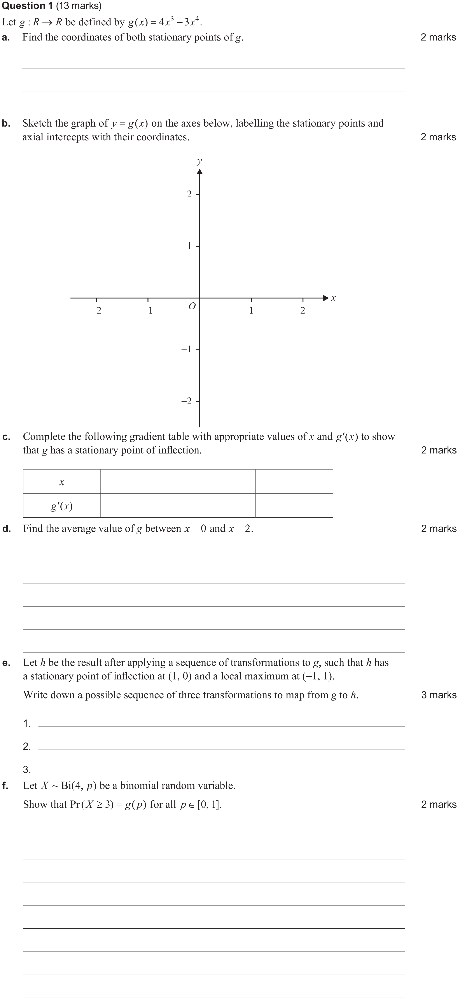
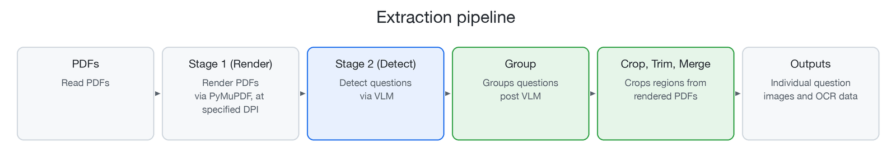
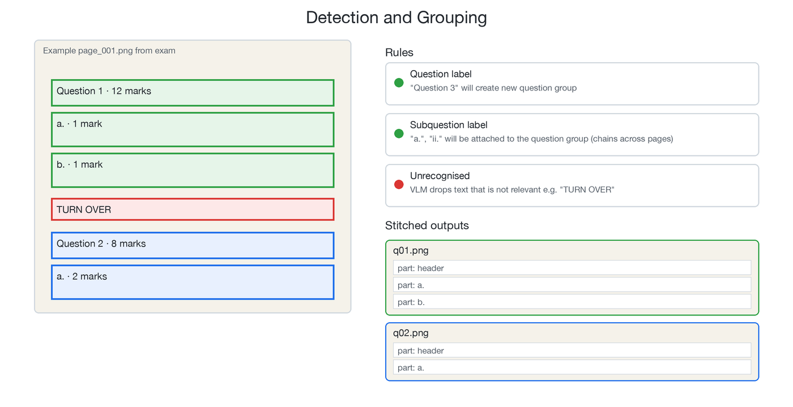

# VCAA Exam Question Extractor

Extract individual exam questions from past VCE examinations. Stitch together multi-page questions, extracts question labels, and saves OCR outputs for each question. The goal is to produce a dataset of exam questions.

Pipeline:

- render each PDF page
- detect question blocks with a vision LLM
- chain blocks into logical questions
- crop, trim, merge
- save images and metadata

All exam content is copyright of the Victorian Curriculum and Assessment Authority (VCAA). This project is for educational purposes only.

Example of a multi-page question:


Explore the [sample output](./sample_output) directory for more examples of extracted questions.

## Architecture



### Detection → grouping (`group_questions`)



Blocks are sorted by (page, y, x), then iterated:

- numeric labels (`"1"`, `"Question 3"`) starts a new group
- subquestion label (`"a."`, `"ii."`) attaches to the current group
- duplicates (rare, detected via overlap and possibly due to hallucination) plus unrecognised labels are dropped

## Quickstart

```bash
pip install -r requirements.txt

python run.py --input papers --output output --config config.yaml
# optional: --dpi 300 --verbose
```

Input PDFs must match `{year}-{source}-exam-{1,2}.pdf`, e.g. `2024-vcaa-exam-1.pdf`. In particular, the strict naming scheme allows the pipeline to determine whether it is exam 1 or 2, since each has unique question types.

## Configuration

An example configuration file is provided as `config.example.yaml`. Rename it to `config.yaml` and fill in your API key.

Example `config.yaml`:

```yaml
api:
    base_url: "https://openrouter.ai/api/v1"
    api_key: ""
    model: "google/gemini-3.8-flash" # any VLM, see below
rendering:
    dpi: 300 # override with --dpi
output:
    image_format: "png"
```

Regarding the model, any VLM that can detect boxes and return JSON is suitable. The Google Gemini series of models have been tested personally and works well whilst being economical. I recommend the [RoboFlow Leaderboard](https://playground.roboflow.com/models) to find other suitable models.

## Output

```text
output/
  index.json          # aggregate: exams, total_exams, total_questions
  2025-vcaa-nht-exam2/
    mapping.json      # per-exam
    mc01.png  q01.png  ...
```

Example `mapping.json` entry:

```json5
{
  "number": "4",
  "image": "mc04.png",
  "type": "mcq", // Otherwise "short"
  "marks": null,
  "pages": [4],
  "has_subquestions": false,
  "cross_page": false,
  "text": "Question 4\nConsider the system of equations below containing the parameter k, where k \\in R.\nkx + 3y = k^2\n2x + (2k + 1)y = 6 - 2k\nFind the value(s) of k for which this system has no real solutions.\nA. k = -2 only\nB. k = \\frac{3}{2} only\nC. k = -2 or \\frac{3}{2}\nD. k \\in R \\setminus \\left\\{-2, \\frac{3}{2}\\right\\}"
}
```

Types of questions:
- `mcq` - multiple choice question (exam 2)
- `short` - short answer question (exam 1, exam 2)

## Project Structure

```text
run.py               # CLI
config.yaml          # Configuration
src/
  pdf_utils.py       # Page rendering
  detector.py        # Detection via LLM (API calling, prompting, response parsing)
  post_ocr.py        # Grouping and chaining
  cropper.py         # Crop, trim, merge
  models.py          # Dataclass models for config, detection, grouping, and
  pipeline.py        # Orchestrator
tests/
papers/
output/
```

## Tests

This project uses `pytest` for testing. To run the tests, execute the following command:

```bash
pytest
```

## Further work

- One could extract answers from the VCAA exam solutions, and match them to the questions. This would allow for a dataset of question-answer pairs, which could be used for training or evaluating models.
- Questions can be labelled by their OCR results with their corresponding topics, which would aid students in their exam preparation.
